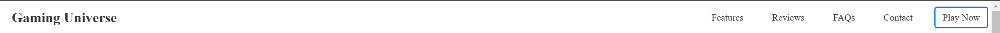
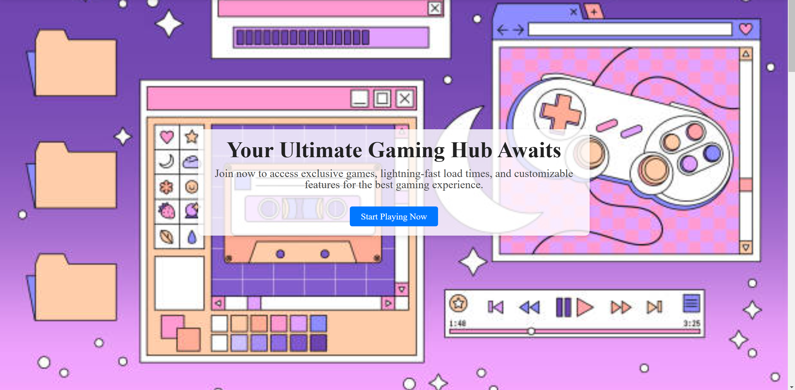
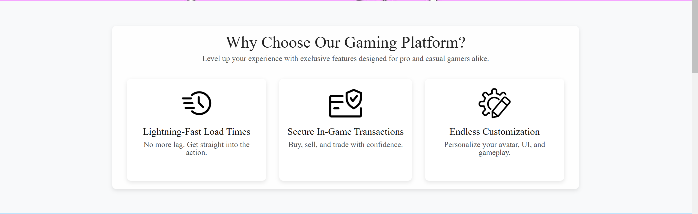
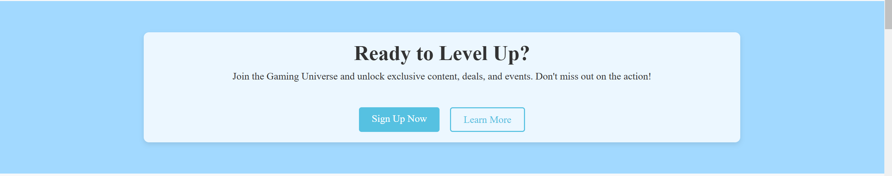
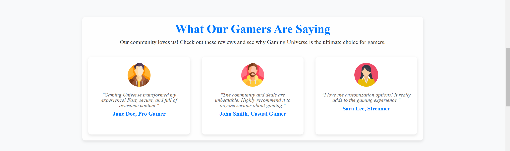
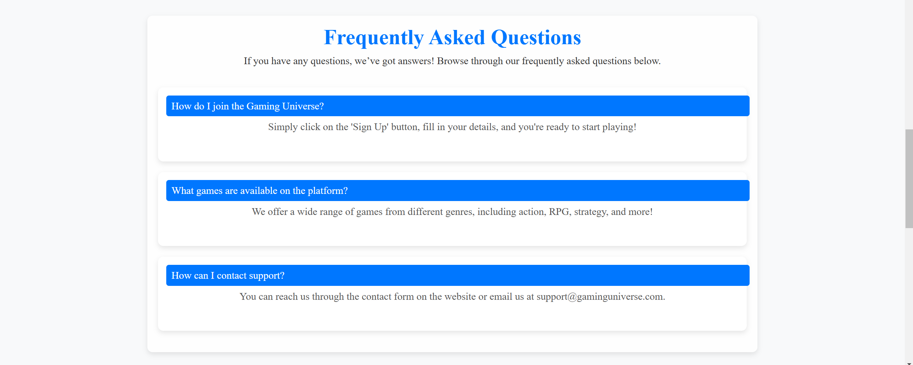

# Lab 2 - Landing page

Create a web page for your/friends/relatives business (example: car-rent, cookies-shop, crypto-scam)

## Customer requirements

- Some form of navigation to sections (links, buttons)
- Call to action
- At least 4 sections ([see examples](https://webflow.com/blog/high-converting-landing-page))
- Pleasant to the eyes

## Dev requirements

- Use vanilla CSS and HTML (no frameworks)
- Have a decent git history (no one commit)
- The page should be deployed on a free hosting service (example: GitHub Pages, Vercel, Netlify)
- Project repo should have a README with a short description of the landing page topic, screenshots, and a link to the live demo

## Other requirements:

- For potential maximal mark, a WIP version should be submitted during the class
- Use index.html, reset.css

## Description

For this laboratory work I decided to create a Landing Page for a madeup website - Gaming Universe. It is an immersive landing page for a gaming platform that provides a smooth, secure, and customizable experience for gamers of all types. This project uses HTML and CSS as it was specified in the requirements.

### Sections Included

- **Navigation Bar**: Fixed at the top with links to various sections of the page.

- **Hero Section**: Prominent call to action with a welcoming message.

- **Value Proposition**: Highlights the main benefits of the gaming platform, including fast load times, secure transactions, and customizable features.

- **Call to Action**: Encourages users to sign up and start playing.

- **Social Proof**: Displays testimonials from happy users to build trust.

- **FAQs**: Provides answers to common questions, including how to join and what games are available.

- **Contact Section**: Offers ways to get in touch for support, including phone and email contact, plus a contact form.

### Live Demo

**Github Pages Link:** https://bostan-victor.github.io/tum-web-lab2/ 