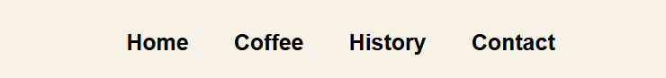

# Lab 2 - Landing page

Create a web page for your/friends/relatives business (example: car-rent, cookies-shop, crypto-scam)

## Customer requirements

- Some form of navigation to sections (links, buttons)
- Call to action
- At least 4 sections ([see examples](https://webflow.com/blog/high-converting-landing-page))
- Pleasant to the eyes

## Dev requirements

- Use vanilla CSS and HTML (no frameworks)
- Have a decent git history (no one commit)
- The page should be deployed on a free hosting service (example: GitHub Pages, Vercel, Netlify)
- Project repo should have a README with a short description of the landing page topic, screenshots, and a link to the live demo

## Other requirements:

- For potential maximal mark, a WIP version should be submitted during the class
- Use index.html, reset.css

## Description

For this laboratory project, I created a landing page for a fictional coffee shop called COFFEEBOX. This immersive landing page is designed to offer a seamless, secure, and customizable coffee ordering experience while introducing users to the brand. The project is built using HTML and CSS, as specified in the requirement

## Sections Included

- **Navigation Bar**: The navigation bar is fixed at the top of the page, allowing users to quickly access different sections of the website. It contains links to Home, Products, History, and Contact sections, ensuring smooth navigation. The design is simple, clean, and intuitive, providing an excellent user experience.

- **Home section**: This section serves as an introduction to the coffee shop, its values, and its offerings. It presents a welcoming message along with visually appealing elements that capture the essence of the brand. Visitors can get a sense of the ambiance and the premium quality coffee products offered.

- **Product section**: The product section highlights some of the best offerings available at the coffee shop. It includes detailed descriptions of different coffee blends, pastries, and other items available for purchase. High-quality images are displayed alongside product details to entice customers and encourage them to explore further.

- **History section**: This section provides insight into the journey of the coffee shop, including its origins, growth, and milestones achieved over the years. It may feature historical photographs, timelines, and interesting anecdotes about the shop’s establishment and evolution.

- **Contact section**: The contact section contains information on how customers can reach the coffee shop. This includes a physical address, phone number, email, and social media links. A contact form may also be provided, allowing users to send inquiries directly from the website.

### Conclusion 

In conclusion, this laboratory work allowed me to understand what a Landing Page is and what it's structure should be.

### Live Demo

**Link:** https://wplab2.netlify.app/ 
